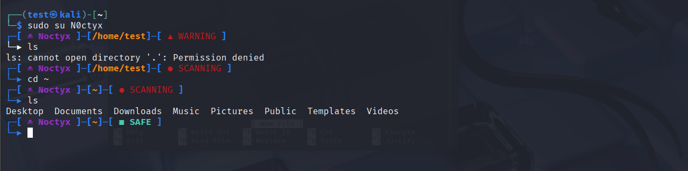

# noctyx-prompt
Customizable cyberpunk hacker Bash prompt with dynamic threat alerts
# Noctyx Hacker Prompt


Personalizable cyberpunk-themed Bash prompt with:
- Dynamic threat levels
- Git integration
- Nickname customization
- Root/user detection

## Installation
```bash
git clone https://github.com/yourusername/noctyx-prompt.git
cd noctyx-prompt
chmod +x install.sh
./install.sh
```

## Features
- Set your hacker nickname during install
- ☠ Changes color when in root mode
- Random security status alerts (blinking intrusion!)
-  Git branch visibility

## Customization
Edit `NOCTYX_NICKNAME` in your `~/.bashrc` to change your nickname.

## Requirements
- Bash 4.0+
- Nerd Font (recommended: FiraCode Nerd Font)
